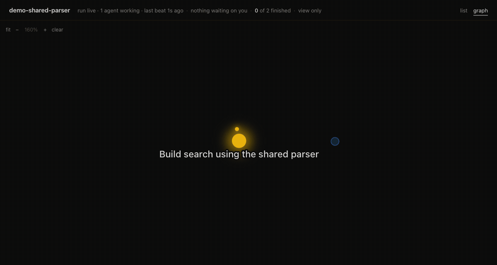

# Ostoyae

*Armillaria ostoyae* (oh-STOY-ay): one fungus, 2,385 acres of Oregon, almost all of it underground
([USDA Forest Service](https://www.fs.usda.gov/sites/nfs/files/r06/malheur/publication/Humongus%20Fungus.pdf)).

**Ostoyae grows the same way through your code: whatever blocks an agent becomes the next job.**

You give it a list of jobs: bugs, features, issues from your repos. It runs a coding agent (Claude
Code, Codex and [others](docs/executors.md)) on each one in its own git worktree, in parallel
where nothing depends on anything, in order where something does: the jobs form a DAG (directed
acyclic graph), and Ostoyae runs it as one. The DAG grows while it runs. When an agent gets stuck
because a piece of work is missing, it says so; the missing piece is added as a new node, with an
edge that makes the stuck job wait for it, and nothing is retried into the same wall. A job can
carry a check command, and its work only counts once the check passes. `ostoyae land` puts the
finished work on your branch.

No npm dependencies. Node.js 22+, Git, Bash and Python 3. macOS, Linux, any VM or box you can SSH
into, and Windows through WSL2.



## One interface for the agent, another for you

Your agent operates the CLI. The browser viewer shows the graph, discoveries, progress, cost and decisions; the terminal dashboard reads the same board.

```sh
curl -fsSL https://raw.githubusercontent.com/teal-sea/ostoyae/main/install.sh | bash
ostoyae demo                   # scripted agents, no model calls
```

The installer needs no sudo. It checks for Node.js 22+, Git, Bash and Python 3, installs into `~/.ostoyae`, and links `~/.local/bin/ostoyae`. Run it again to upgrade; `bash install.sh --uninstall` removes it. For SSH, see [running on another machine](docs/remote.md).

Or install from a checkout. Nothing is published to npm; this installs your local checkout. Without a global install, use the absolute path to `bin/ostoyae`.

```sh
git clone https://github.com/teal-sea/ostoyae.git
cd ostoyae
npm install --global .
```

```sh
cd your-repo
ostoyae init --agent claude --item "Make the flaky test deterministic"
ostoyae doctor                 # prerequisites and saved auth; no model prompt
ostoyae dry                    # review without changing the board
ostoyae go --invocations 3      # at most 3 total sessions, including map and judge
ostoyae watch --browser        # the human view, served on localhost; add --control to decide from it
ostoyae status --json          # structured state for the orchestrating agent
ostoyae land                   # take the finished work onto your branch
```

Finished work collects on `ost/<graph>/trunk`. `ostoyae land` fast-forwards your base branch to it. It refuses a non-fast-forward, modified tracked files in the base checkout, or a board with a runner file still present, and prints a `git merge` command instead.

## Point it at your issues

In the repository with the bugs:

```sh
ostoyae import github OWNER/REPO --check "npm test"
ostoyae go --invocations 3
ostoyae land gh-42
```

Import creates the board if needed, skips pull requests, and asks the agent to add a regression test for each bug. It only takes issues from people with push access, because issue text becomes the agent's instructions; `--any-author` includes the rest once you have read them. `land gh-42` builds a branch named `ostoyae/gh-42` with that bug and its unfinished dependencies, checks it, and prints the command to open a PR. It leaves your checkout alone. Use `ostoyae import github OWNER/REPO --dry-run` to preview updates.

`init` saves the provider, model, effort (`--effort LEVEL`) and execution profile. Choose `claude`, `codex`, `gemini`, `aider`, `opencode`, `muse`, `grok`, `hermes`, or a custom executor. Model IDs pass through unchanged. Run `ostoyae providers` for adapter status. For Codex, supply your accessible model ID with `--model`.

One board can mix agents: set `defaults.agent`, a job's `params.agent`, `mapping.params.agent`, or `judge.params.agent` alongside each role's model and effort. `go --agent` overrides the mix. Messaging between running attempts is on by default: each attempt is told which attempts are running beside it, and when two of them change the same file Ostoyae messages both. `go --no-messaging` or board `"messaging": false` turns it off.

## Using it from Hermes

Install the chat skill with `hermes skills install https://raw.githubusercontent.com/teal-sea/ostoyae/main/skills/ostoyae/SKILL.md`. Then ask Hermes to use the Ostoyae skill in your repository. The skill explains the CLI and asks for a cap before launching agents.

Several boards can work in one repository:

```sh
ostoyae init parser.json --agent claude --item "Build the parser"
ostoyae init search.json --agent claude --item "Add search"
ostoyae boards --json
# In separate agent sessions, with the allowance you approved for each:
ostoyae go --board parser.json --invocations 3
ostoyae go --board search.json --invocations 3
```

Each board has its own work, branches, allowance and viewer. `watch --board parser.json --browser` opens that board; a second viewer chooses a free port. Browser tabs keep their own selection. The page only shows the board unless the viewer was started with `--control`; without it, decisions and launches happen in the terminal and the page prints the command. The `boards` command finds registered boards from another project; `boards --json` exposes matching tasks across boards, but does not deduplicate them. See [working with multiple boards](docs/portability.md#multiple-boards).

```sh
ostoyae init --agent codex --model YOUR_MODEL_ID --profile claude-cloud --item "Your task"
ostoyae init local.json --agent opencode --model YOUR_PROVIDER/YOUR_MODEL --profile headless --item "Your task"
```

Cloud profiles work in a terminal workspace, including one opened from a phone. Detached checkouts use the current commit. Windows uses WSL. Provider CLIs still need installation, authentication and network access. `doctor` checks available auth without a model prompt, but cannot prove model access or quota. Gemini, Aider and OpenCode remain experimental with stub contract tests. See [portability and configuration](docs/portability.md) and the [executor contract](docs/executors.md).

## The example this was built from

An agent trying to prove the Hardy-Ramanujan theorem in Lean finds that Mathlib lacks Mertens second theorem. **Mertens becomes a task; Hardy-Ramanujan waits.** Once Mertens is proved, the blocked task can continue from that work.

## What it has measured

One head-to-head run so far. Six formalization tickets all needed the same library vendored
first. Run head-on, each of the six agents built that prerequisite for itself. Run through
Ostoyae, the missing prerequisite became one job, was built once, and five of the six tickets
then landed on top of it; the sixth was parked when a launch cap was reached. That is one run
of each arm, not a controlled experiment, so no cost or speed claim is made here. The record,
including two earlier pilots where the graph lost, is in
[`wiki/log/2026-08-31-the-recovered-ab-where-the-graph-won.md`](wiki/log/2026-08-31-the-recovered-ab-where-the-graph-won.md).
A later cloud campaign is logged [here](wiki/log/2026-09-10-the-first-cloud-campaign.md).

## Vocabulary

See the [vocabulary](docs/vocabulary.md) for board and run terms.

## How it works

```
          ┌────────────────────────────────────────────┐
          │                 board.json                 │
          │     work[]     edges[]     attempts[]      │
          └────────────────────────────────────────────┘
             │                                  ▲
  ready work │                                  │  the board absorbs what
  (deps met) ▼                                  │  came back, as `proposed`
        ┌──────────────┐    handback            │
        │     cell     │  .ostoyae/report.json  │
        │  1 agent     │ ───────────────────────┘
        │  1 branch    │   { wall, work, edges }
        │  1 port      │
        └──────────────┘
                                    ┌───────────────────────┐
   nothing proposed is scheduled ──▶│  you                  │
   until it is confirmed            │  confirm  /  reject   │
                                    └───────────────────────┘
```

**The cell.** An attempt never runs in a shared environment. It gets its own git worktree on
its own branch, its own port, and a database cloned from a template when the project has one.
The environment is replaced rather than extended, so a `DATABASE_URL` in the shell that
launched the runner cannot reach an agent. An attempt starts from the trunk plus the branches
of the attempts it depends on, so a dependency hands over content and not just ordering.
Without a `sandbox` block the runner refuses to execute anything.

**The handback.** After the executor exits and before the cell is torn down, the runner reads
`.ostoyae/report.json` from the worktree:

```json
{
  "wall":  "there is no idempotency column to guard the confirm path on",
  "work":  [ { "id": "w-schema", "what": "add an idempotency key column" } ],
  "edges": [ { "from": "w-schema", "to": "w-confirm", "why": "the guard has nothing to read" } ]
}
```

**Proposals are inert by default.** Everything in that report lands on the board as `proposed`,
with the attempt that found it and the date. The normal path is your explicit decision.
With `--auto-advance`, a configured judge and a positive cap, a bounded invocation can confirm fully judged routes to its original open tickets. It cannot accept statement revisions or reopened edges. Other governance questions remain in [`wiki/open.md`](wiki/open.md).

**Three outcomes, not two.**

| state | it did the work | it found structure |
|---|---|---|
| `done` | yes |  |
| `failed` | no | no |
| `walled` | no | yes |

A walled attempt's item is parked until you answer, because retrying before that
walks into the same wall. Its partial work is committed to its branch with a subject line that
says so, and its exit code is unchanged, so the record says exactly what happened.

**The judge.** With `judge` on, nothing above is taken on the agent's word. A work item's
`check` runs on a fresh checkout of the attempt's branch, not in the cell it worked in, and its
exit code decides `done`. Every handback that proposes something gets a verify attempt, a
different agent with a different prompt, that hands back a verdict on each proposal and on the
wall. A wall that only restates its task is a failed attempt.

**The viewer.** `bin/ostoyae watch` serves a page on `127.0.0.1` that redraws the board every
time the runner writes it. Each job is a circle, each attempt a smaller circle orbiting it, each
edge an arrow, and the right-hand rail has one card per proposal with what saying yes or no
would do, computed by the same scheduler the runner uses. Yes and no are buttons.

## A worked run

With two independent items and the fake executor:

```sh
node run.mjs wall.json --exec "bash executors/fake.sh"
```

The example walls on a missing idempotency column and proposes `w-schema` and `e-0001`. With nothing confirmed, another run starts nothing. Confirm with `node run.mjs wall.json --confirm w-schema,e-0001`; the next run builds `w-schema` first, then retries `w-confirm` from that branch. The full transcript is in [`docs/running.md`](docs/running.md).

## Running it

```
bin/ostoyae init [board.json] --item "..." [--item "..."]   write a board for the repo you are in
bin/ostoyae doctor [board.json]        can this machine run it? Checks before spending
bin/ostoyae dry [board.json]           walk the board, touch nothing
bin/ostoyae go [board.json] --launches 3       viewer up, then run, stopping after 3 agent sessions
bin/ostoyae go [board.json] --usd 15           ...or when $15 has been spent
bin/ostoyae go [board.json] --invocations 20   ...or after 20 sessions of any kind, across restarts
bin/ostoyae watch [board.json]         viewer only, nothing runs
bin/ostoyae confirm [board.json] e-0001,w-schema     answer proposals
bin/ostoyae reject  [board.json] w-alerts            close a route
bin/ostoyae status [board.json]        what is up, what the board says
bin/ostoyae stop [board.json] [--now]  stop the run; --now kills the cells too
bin/ostoyae land [board.json]          fast-forward your branch to the finished work
bin/ostoyae COMMAND --help             help for one command
```

An explicit board path wins; otherwise `OSTOYAE_GRAPH`, then `./ostoyae.json`, then the checkout's gitignored `graph.local.json` selects it. With no board, run `init`. Relative paths resolve from your current directory. `OSTOYAE_EXEC` chooses the executor; the default runs Claude Code. `OSTOYAE_PORT` moves the viewer.

`doctor` runs before every `go`. It checks the board, repository and base, worktree root, linked caches, stale branches and available executor auth. Claude uses `claude auth status`; Codex uses `codex login status`. Gemini, Aider, OpenCode, Muse and Grok check CLI availability only. No model prompt is sent. Explicit tool probes can run their configured commands. Cells keep `PATH`, `HOME`, `USER`, `SHELL`, `TMPDIR` and values named in `sandbox.env_passthrough`.

Caps stop new launches; in-flight attempts finish, and a later run continues from the record. See [`docs/running.md`](docs/running.md) for what each cap counts.

### Requirements

- Node 22 or later, tested on 24, and `git`.
- Bash and Python 3 for the shipped executors. The engine itself needs neither.
- The agent CLI you choose, installed and logged in. Nothing is installed by this repo.
- Linux or macOS. On Windows, run it inside WSL2; native Windows is not supported.

### Executors

An executor is any shell command. It receives the attempt as JSON on stdin, works in the cell,
writes its handback and usage, and exits non-zero to fail or wall. The harness commits; the
agent never runs git.

| executor | agent | verified against the real agent |
|---|---|---|
| `executors/claude.sh` | Claude Code | yes, in production runs |
| `executors/codex.sh` | OpenAI Codex CLI | yes, one scratch cell |
| `executors/gemini.sh` | Gemini CLI | no, stub-rehearsed only |
| `executors/aider.sh` | Aider | no, stub-rehearsed only |
| `executors/opencode.sh` | OpenCode | no, stub-rehearsed only |
| `executors/muse.sh` | Muse Code | yes, three scratch cells |
| `executors/grok.sh` | Grok Code | yes, four scratch cells |
| `executors/hermes.sh` | Hermes Agent | yes, scratch cells and a mixed board beside Claude |
| `executors/fake.sh` | none | the zero-model-call executor every test uses |

The contract and how to write your own are in [`docs/executors.md`](docs/executors.md). The
Codex adapter's differences from the Claude one are in [`docs/codex.md`](docs/codex.md), the
Muse one's in [`docs/muse.md`](docs/muse.md), the Grok one's in [`docs/grok.md`](docs/grok.md).

## The board

A board is a JSON file containing jobs, dependencies and attempts.

```json
{
  "graph": "fix-booking-race",
  "concurrency": 3,
  "max_attempts": 3,
  "sandbox": {
    "repo": "/home/you/pay-service",
    "root": "/home/you/ostoyae-worktrees",
    "base": "main",
    "port_base": 4100,
    "link": ["node_modules"]
  },
  "work": [
    { "id": "w-schema",  "what": "add the idempotency column", "needs": [], "check": "npm test" },
    { "id": "w-confirm", "what": "guard the confirm path",     "needs": ["w-schema"] }
  ],
  "edges": [],
  "attempts": []
}
```

See [`graph.schema.md`](graph.schema.md) for fields and [`examples/`](examples/) for boards.

Put known dependencies in `work[].needs`. Discovered edges do not affect readiness until confirmed.

## Tests

The fake executor runs the regression suite without model calls:

```sh
npm test
```

The suite also packs and installs the package offline. Real-agent verification status is in the executor table above.

## Status

The wall-to-task loop has run on live boards, with transcripts in `wiki/log/`. The single head-to-head result above is not a controlled experiment. Open questions are in [`wiki/open.md`](wiki/open.md); the design is in [`wiki/model.md`](wiki/model.md).

Released under the [MIT license](LICENSE).

## Where to look

- [`run.mjs`](run.mjs) and [`lib/`](lib/): scheduling and board logic.
- [`sandbox.mjs`](sandbox.mjs): cell provisioning and teardown.
- [`doctor.mjs`](doctor.mjs): preflight checks.
- [`viewer/`](viewer/): board display and shared state derivation.
- [`executors/`](executors/): agent adapters.
- [`docs/`](docs/): operational reference.
- [`wiki/`](wiki/): design, open questions and run logs.
- [`CONTRIBUTING.md`](CONTRIBUTING.md): contributing.
